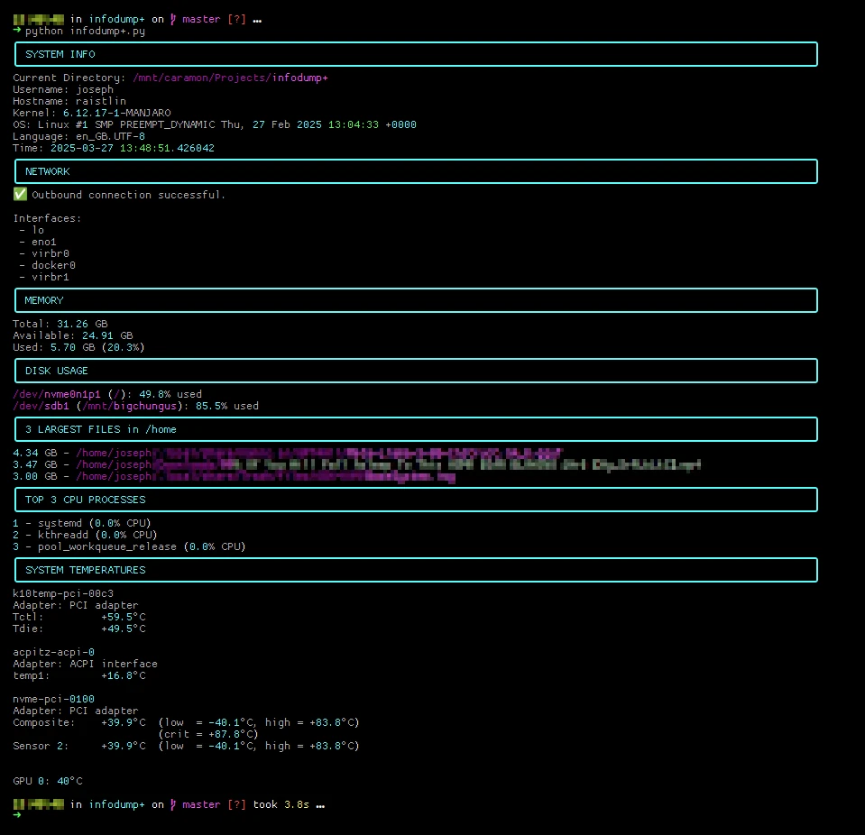

# infodump+

`infodump+` is a lightweight Linux system diagnostics tool designed to provide quick, at-a-glance insights into node health and performance. Originally written in Bash and later rewritten in Python, the tool collects and displays key system information — including CPU usage, memory stats, disk utilization, network status, and top resource-consuming processes — all in a human-readable CLI format.

The goal is to simulate the kind of environment-aware tooling often used by support engineers working with distributed systems, HPC clusters, or cloud infrastructure.

This project serves as both a practical utility and a learning exercise in systems automation, scripting, and continuous improvement.

_The original script was published as a gist [here](https://gist.github.com/ctrl-alt-fail/52ca731bbe1a97a8c1184b0a1ef95c7b)._

---

# How I Used AI to Improve My Bash Script — and Became a Better Engineer

In 2022, I wrote a Bash script called `infodump` — a simple diagnostic tool that prints out key system information like CPU usage, network status, memory stats, and disk space. At the time, it helped me automate checks in Linux environments I managed at home.

But recently, I decided to revisit and improve it using a powerful tool — AI.

## How AI Helped Me Improve It

With help from ChatGPT, I:

- **Modularized the structure** — breaking the script into clean, testable functions
- **Identified gaps** — like missing error handling or repeated code.
- **Rewrote the tool in Python** — using libraries like `psutil` and `subprocess`.
- **Planned future improvements** — log output, optional CLI flags, and even a Streamlit dashboard.

## What I Learned

Using AI tools like ChatGPT isn't just about generating code — it's about building better intuition. I was able to:

- Refactor more cleanly
- Adopt Pythonic practices for readability
- Learn which libraries to use for low-level system inspection
- Understand how this kind of tool might operate in a real support environment

## The Project

The tool is now available in two versions:
- 🐚 [Original Bash script](https://github.com/ctrl-alt-fail/infodump-plus/blob/main/infodump.sh)
- 🐍 [Python rewrite](https://github.com/ctrl-alt-fail/infodump-plus/blob/main/infodump+.py)

## Final Thoughts

Whether you're supporting a production system or just trying to learn, creating real tools — then improving them with help — is a powerful way to grow. This project gave me a clearer sense of how to support infrastructure, and how to keep learning along the way.

Oh, and this README was generated using AI 😉.
